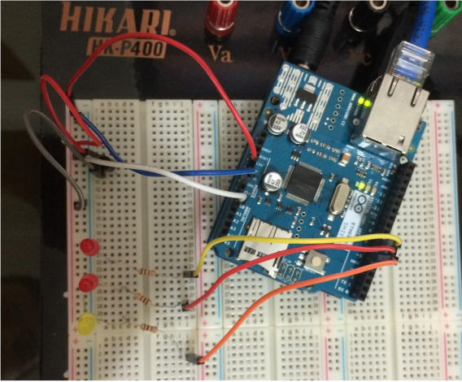

# Medidor de temperatura (LM35) em rede (arduino e ethernet shield)

A ideia deste projeto consiste num servidor (Arduino + ethernet shield) que
obtém a temperatura do ambiente e se comunica com o cliente que irá estar
em seu notebook. 

Dependendo da temperatura do ambiente enviada do
servidor para o cliente, este poderá fazer uma requisição, momentos antes
de chegar em casa, para que o ar condicionado seja ligado na temperatura
desejada.

Assim, tanto no momento em que o cliente consulta a temperatura em que o ambiente está quanto no momento em que ele estipula a temperatura desejada
para o ar condicionado antes de chegar em casa, um dos três LEDS irá acender, de acordo com as faixas de temperatura, estabelecidas na tabela I.

<table>
  <tr>
    <th>LED</th>
    <th>Faixa de temperatura (t), em °C</th>
  </tr>
  
  <tr>
    <td>LED 1</td>
    <td>t <= 25</td> 
  </tr>
  
  <tr>
    <td>LED 2</td>
    <td>(t > 25) && (t <= 27)</td>
  </tr>
  
  <tr>
    <td>LED 3</td>
    <td>(t > 27) && (t <= 40)</td>
  </tr> 
</table>
Tabela I: LEDS e faixas de temperaturas correspondentes.

Escolhemos o protocolo TCP (DHCP) por oferecer garantia de entrega de
mensagens, sendo mais seguro do que o protocolo UDP.

Na Figura 1 é representada e visão física do sistema proposto.

Figura 1: Visão física do sistema.
